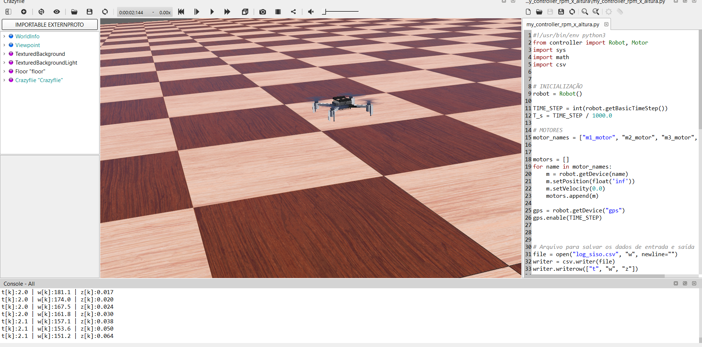

##**Identificação de Sistemas Não Lineares**
Os sistemas lineares estão presentes em muitos campos de estudo, e muitas vezes eles são assumidos mesmo em modelos não lineares, para simplificação e aplicação de alguns tipos de modelagem, como a modelagem de Laplace ou de fourier.

Os sisteams lineares são caracterizados desse jeito, porque a equação diferencial que rege a dinâmica do sistema tem coeficientes constantes, e assim a saída do sistema pode ser modelada como a convolução da entrada com a resposta ao impulso do mesmo.

Porém, nem sempre a assunção de um sistema ser linear é verdadeira, assim, as vezes é preciso capturar a não linearidade e suas características para que uma precisão seja alcançada para determinada aplicação.

Nesse contexto, a identificação de sistemas não lineares entra, e com ela, é possível, utilizando aprendizado de máquina, capturar a dinâmica não linear de um sistema.

Considere um sistema dada pela equação

$$
\ddot{y}(t) = a_1 \dot{y}(t) + a_0 y(t) + x(t)  
$$

ou ainda em forma de equação de diferenças, temos

$$
y[k+2] = a_1 y[k+1] + a_0 y[k] + x[k]
$$

se os coeficientes $a_1$ e $a_0$ são constantes, o sistema é linear, porém, uma regra geral pra sistemas não lineares pode ser da forma

$$
y[k] = f(y[k-1],y[k-2],x[k],x[k-1])
$$

aqui consideramos causalidade e também que dependem de poucos atrasos no tempo.

Nomeando ainda, todas as variáveis dependentes como uma só, na forma matricial dada por

$$
\mathbf{U}[k] = (y[k-1],y[k-2],x[k],x[k-1])
$$

então o modelo se torna

$$
y[k] = f(\mathbf{U}[k])
$$

Então utilizaremos uma abordagem com funções de base radial, para estimar a não linearidade do sistema, temos então que a saída em função do tempo se torna

$$
y[k] = \sum_{i = 0}^{N_c}  w_i \Phi({ \frac{-||\mathbf{U}[k] - \mathbf{Z}_i||_2^2}{2 \sigma_i^2} })
$$

onde $N_c$ representa o número de funções de base, $\mathbf{Z}$ representa o vetor de centros, $\sigma_i^2$ representa a variância de cada componente da base.

Podemos então fazer um treinamento supervisionado com alguns dados para o sistema, e fazê-lo aprender a dinâmica do sistema utilizando algum algoritmo de otimização para ajustar os pesos $\alpha_j$, e então validar com outra entrada e saída.

A forma vetorial da equação de ajuste é dada por

$$
\mathbf{y} = \mathbf{\Phi} \mathbf{w}
$$

onde $\mathbf{w}$ é o vetor de pesos da rede, e a lei de formação da matriz $\mathbf{\Phi}$ é:

$$
{\Phi}[k,i] = \Phi_{\sigma_i}(\mathbf{U}[k] - \mathbf{Z}_i)
$$

o vetor de pesos ótimo para pode ser encontrado pela solução de mínimos quadrados, então podemos usá-la para fazer o treinamento, assim definimos a função de custo

$$
J(\mathbf{w}) = \frac{1}{2N}||\mathbf{y} - \mathbf{\Phi} \mathbf{w}||_2^2
$$

o ponto de mínimo dessa função é

$$
\mathbf{w} = ( \mathbf{\Phi}^T  \mathbf{\Phi})^{-1}  \mathbf{\Phi}^T \mathbf{y}
$$

assim podemos reconstruir finalmente a saída do sistema como

$$
\mathbf{y}_{est} = \mathbf{\Phi}(\mathbf{U}) \mathbf{w}_{otm}
$$

a função de base escolhida para as implementações foi a inversa multiquadratica, dada por

$$
\phi_{\sigma}(\mathbf{r}) = \frac{1}{\sqrt{1 + \frac{||\mathbf{r}||_2^2}{\sigma^2}}}
$$

##**Sistema não Linear: Exemplo 2**

O sistema não linear descrito pela equação de diferenças

$$
y[k+1] = 0.3y[k] + 0.6y[k-1] + 0.6 sin(πu[k]) +\frac{0.4 sin(3πu[k])}{5.5} + e[k]
$$

é descrito no artigo [1], onde $e[k]$ representa um ruído aleatório, que nesse caso será modelado como ruído AWGN.

##**Sistema não Linear: Pêndulo Simples**

 Para simular um sistema não linear real, o pêndulo, vamos utilizar a equação física e discretizá-la
 Então a equação física é dada por

 $$
\ddot{\theta}(t) = -\frac{g}{L} sin(\theta(t)) + u(t)
 $$

então fazendo uma substituição de variáveis

 $$
 \begin{cases}
\dot{\theta}(t) = p(t) \\
\dot{p(t)} = -\frac{g}{L} sin(\theta(t)) + u(t)
\end{cases}
 $$

aplicando o método de euler para resolver a equação

 $$
 \begin{cases}
 p(t + \Delta t) = p(t) + \Delta t (-\frac{g}{L} sin(\theta(t)) + u(t))  \\
\theta(t + \Delta t) = \theta(t) + \Delta t \cdot p(t)
 \end{cases}
 $$

 discretizando essa equação, temos

$$
 \begin{cases}
 p[k + 1] = p[k] + h (-\frac{g}{L} sin(\theta[k]) + u[k]) \\
\theta[k+1] = \theta[k] + h \cdot p[k]
 \end{cases}
 $$

##**Sistema não Linear: Drone No Webots**

Para simular com um dado quase real, vamos simular a resposta de um Drone de quatro motores no Webots(Crazyflie) e verificar se a nossa rede consegue aprender a dinâmica de um sistema real, assim, vamos definir a entrada como sendo um valor de velocidade angular direto, e a saída a posição $z$ do drone em tempo real.

As equações diferenciais que regem o movimento vertical de um drone com quatro hélices/motores como um sistema SISO são:

$$
\begin{cases}
\omega_1 = \omega_2 = \omega_3 = \omega_4 = \omega(t) \\
\ddot{z}(t) = f(\dot{z}(t),z(t), \dot{\omega}(t),\omega(t))
\end{cases}
$$

A força resultante no centro de massa do drone é

$$
F_{res} = -P + F_{helices}
$$

ou seja, para o drone dar partida, a força das 4 hélices precisa superar o peso do próprio drone.

Além disso, pela segunda lei de Newton, em regime transiente a equação de movimento é justamente

$$
m \ddot{z}(t) = -P + F_{helices}(t)
$$

A força das hélices é a força de reação do ar devido ao motor empurrar o mesmo para baixo, e apesar de ser não linear globalmente, o sistema pode ser aproximado por um sistema linear de 2ª ordem na vizinhança do ponto de operação.

Um modelo aceitável para a modelagem da força das hélices é

$$
F_{helices}(t) = K \cdot \omega(t)^2
$$

o que prova a não linearidade do sistema, e a motivação para a utilização da técnica de identificação de sistemas.

Discretizando o modelo para implementação, temos ainda

$$
\begin{cases}
\omega_1 = \omega_2 = \omega_3 = \omega_4 = \omega[k] \\
{z}[k] = f_d(\dot{z}[k-1],z[k-2], \dot{\omega}[k],\omega[k])
\end{cases}
$$

*Figura 1: Simulação de Drone no Software Webots*
